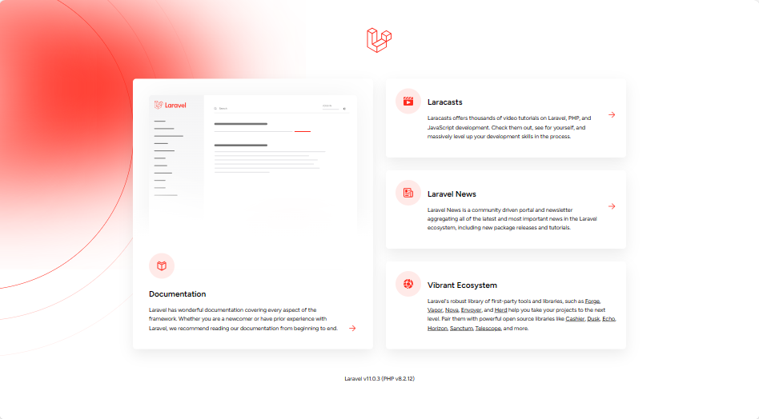

## Laravel v11.x Update

<p align="center"></p>

Laravel 11 introduces a minimal application structure, using SQLite by default, implementing health routing, offering per-second rate limiting, supporting graceful encryption key rotation, improving queue testing, introducing new Artisan commands, adding Resend mail transport, integrating Prompt validator, and more. 

PHP 8.2 is the minimum requirement.


## Minimal Application Structure

Laravel 11 introduces a minimal application structure for new Laravel applications, without requiring any changes to existing applications. The new application structure is intended to provide a leaner, more modern experience, while retaining many of the concepts that Laravel developers are already familiar with.

The `app` folder has been massively simplified; both the HTTP and Console kernels have been removed. The nine middlewares that were rarely customized have now been moved into the framework itself, the exception handler has been removed, and the Providers directory has been streamlined to a single provider.

When you install a new Laravel project, the folder structure will look like this:

```
app/
├── Http/
│   └── Controllers/
│       └── Controller.php
├── Models/
│   └── User.php
└── Providers/
    └── AppServiceProvider.php
bootstrap/
├── app.php
└── providers.php
config
...
```

Removed folders: `app/Console`, `app/Exceptions`, `app/Http/Middleware`.

Routes, Middlewares, and Exceptions are now registered in the `bootstrap/app.php` file.

<b>bootstrap/app.php:</b>

```
use Illuminate\Foundation\Application;
use Illuminate\Foundation\Configuration\Exceptions;
use Illuminate\Foundation\Configuration\Middleware;
 
return Application::configure(basePath: dirname(__DIR__))
    ->withRouting(
        web: __DIR__.'/../routes/web.php',
        commands: __DIR__.'/../routes/console.php',
        health: '/up',
    )
    ->withMiddleware(function (Middleware $middleware) { 
        //
    })
    ->withExceptions(function (Exceptions $exceptions) {
        //
    })->create();
```

Also, cleaned up `routes` folder. The files `routes/channel.php`, `routes/console.php`, and `routes/api.php` have been removed.

Instead, they can be created using simple Artisan commands:

```
php artisan install:api
```

When you run this artisan command, the `routes/api.php` file will be created and registered in the `bootstrap/app.php`, and Laravel Sanctum will be installed. You must only add the `Laravel\Sanctum\HasApiTokens` trait to the `User` Model.

Similarly to the API changes, broadcasting also became installable: to prepare the application, you can use the `php artisan install:broadcast` artisan command.


## SQLite and Pest By Default

The default database for Laravel is changed to SQLite. By default, new Laravel applications use SQLite for database storage, as well as the `database` driver for Laravel's session, cache, and queue. Furthermore, creating a project using composer `create-project` command or through the Laravel Installer will automatically create the SQLite file and run the initial database migrations.

As well as <b>Pest</b> is changed to the default testing framework.


## New Artisan commands

Laravel 11 comes with new `make:` artisan commands. Now, you can create enums, interfaces, and classes.

```
php artisan make:class
php artisan make:enum
php artisan make:interface
php artisan make:trait
```


## Health Routing

New Laravel 11 applications include a health routing directive, which instructs Laravel to define a simple health-check endpoint that may be invoked by third-party application health monitoring services or orchestration systems like Kubernetes. By default, this route is served at `/up`:

```
->withRouting(
    web: __DIR__.'/../routes/web.php',
    commands: __DIR__.'/../routes/console.php',
    health: '/up',
)
```

When HTTP requests are made to this route, Laravel will dispatch a `DiagnosingHealth` event, allowing you to perform additional health checks relevant to your application, such as verifying database connectivity and ensuring the cache is working as expected.


## Dumpable Trait

Laravel 11 introduces a new Dumpable trait. It is intended to replace the current `dd()` and `dump()` methods in most of the framework's classes. Users and package authors can include this trait for easier code debugging.


## Limit Eager Load

Laravel 11 will allow limiting eagerly loaded records natively, without external packages.

```
class User extends Model
{
    public function posts()
    {
        return $this->hasMany(Post::class);
    }
}
```

```
class Post extends Model
{
    // ...
}
```

```
$users = User::with(['posts' => function ($query) {
    $query->latest()->limit(10); 
}])->get();
```


## Casts Method

From Laravel 11, the casts will be provided in the protected method `casts()` instead of the protected property `$casts`. This allows for streamlined, fluent cast definitions, especially when using casts with arguments:

```
class User extends Authenticatable
{
    // ...
 
    protected function casts(): array
    {
        return [
            'email_verified_at' => 'datetime',
            'password' => 'hashed',
        ];
    }
}
```

Also, now it is possible to provide an array.

```
protected function casts(): array
{
    return [
        'bookOptions' => [AsCollection::class, OptionCollection::class],
    ];
}
```


## once() Method

The `once` helper function executes the given callback and caches the result in memory for the duration of the request. Any subsequent calls to the `once` function with the same callback will return the previously cached result:

```
function random(): int
{
    return once(function () {
        return random_int(1, 1000);
    });
}
 
random(); // 123
random(); // 123 (cached result)
random(); // 123 (cached result)
```


## License

The Laravel framework is open-sourced software licensed under the [MIT license](https://opensource.org/licenses/MIT).
